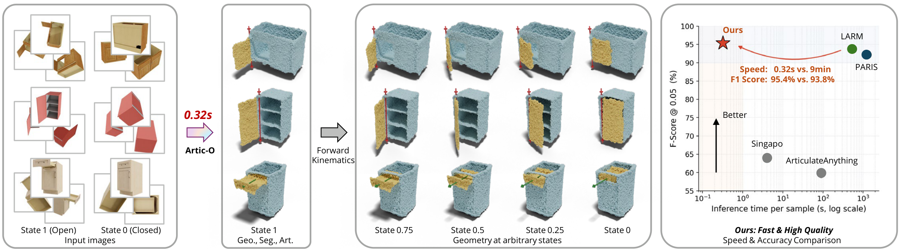

<!-- Citing the arXiv preprint until the proceedings publish (around the
     Dec 1-4 2026 conference). After publication, swap the BibTeX below for the
     ACM entry and restore the DOI badge here:
       booktitle = {SIGGRAPH Asia 2026 Conference Papers (SA Conference Papers '26)},
       doi       = {10.1145/3829340.3842320},
       isbn      = {979-8-4007-2842-6},
       publisher = {Association for Computing Machinery},
       address   = {New York, NY, USA},
       location  = {Kuala Lumpur, Malaysia} -->
<div align="center">
<h1>[SIGGRAPH Asia 2026] Artic-O</h1>
<h3>End-to-End Articulated Object Reconstruction via Latent Geometry Learning</h3>

[](https://wxyxixixi.github.io/Artic-O/) [](https://arxiv.org/abs/2606.21938) [](https://huggingface.co/wxyxixixi/artic-o) [](https://huggingface.co/datasets/wxyxixixi/artic-o-data) [](https://opensource.org/licenses/MIT)

Xuyang Wang<sup>1,2,&ast;</sup>, Zhenyu Li<sup>2</sup>, Jian Ding<sup>2,&dagger;</sup>, Habib Slim<sup>2</sup>, Peter Wonka<sup>2</sup>, Hongdong Li<sup>1</sup>, Mohamed Elhoseiny<sup>2</sup>
<br>Australian National University<sup>1</sup>, KAUST<sup>2</sup>
<br><sub><sup>&ast;</sup>Work done during a research internship at KAUST. &nbsp;<sup>&dagger;</sup>Project lead.</sub>

<center>

</center>

</div>

From sparse images at two articulation states, Artic-O predicts complete geometry,
the active part, and joint parameters in a single feed-forward pass (0.32 s).
Forward kinematics then poses the object at any intermediate state.

This repository releases the **evaluation and inference code** — everything
needed to reproduce the paper's metrics from the released checkpoint and test
split, and to run the model on a single object. Training code and the
figure-rendering pipeline are not part of this release.

---

## News

- **[2026-09-09]** Evaluation and inference code released.

## Environmental setup

Python 3.12 with CUDA 12.4 wheels. Two routes below — they install the same set
of packages, so pick whichever you already use.

### Option A — pixi (what we used)

```bash
pixi install
pixi run pip install torch torchvision --index-url https://download.pytorch.org/whl/cu124
pixi run pip install -r requirements.txt
pixi run pip install torch-cluster -f https://data.pyg.org/whl/torch-2.6.0+cu124.html
pixi run pip install -v --no-build-isolation "git+https://github.com/facebookresearch/pytorch3d.git"
pixi run bash scripts/fetch_third_party.sh
```

`pixi install` resolves from the committed `pixi.lock`, so the conda layer is
reproducible. Prefix every later command with `pixi run`, for example
`pixi run bash scripts/verify_benchmark.sh`.

### Option B — conda

```bash
conda create -n artic-o python=3.12 -y
conda activate artic-o
pip install torch torchvision --index-url https://download.pytorch.org/whl/cu124
pip install -r requirements.txt
pip install torch-cluster -f https://data.pyg.org/whl/torch-2.6.0+cu124.html
pip install -v --no-build-isolation "git+https://github.com/facebookresearch/pytorch3d.git"
bash scripts/fetch_third_party.sh
```

Notes:

- `torch-cluster` (farthest-point sampling) and `pytorch3d` (Chamfer distance,
  kNN) cannot be installed from `requirements.txt` — they need the extra index
  and the source build shown above.
- **`scripts/fetch_third_party.sh` is required**, not optional. CroCo and TripoSG
  are not redistributed here because their licenses are incompatible with this
  repo's MIT license; the script clones both at pinned commits. Each stays under
  its own terms — read [THIRD_PARTY-NOTICES.md](THIRD_PARTY-NOTICES.md) before any
  commercial use. No compilation step is needed: only CroCo's
  `models/blocks.py::DecoderBlock` is used, and its `curope` CUDA extension is not
  imported.

## Datasets and checkpoints

<!-- TODO(release): both repos are private until publication -->

```bash
# evaluation data -> ./data/   (~18 GB: test split, view picks, split list)
hf download wxyxixixi/artic-o-data --repo-type dataset --local-dir ./data/

# checkpoint -> ./checkpoints/   (2.7 GB, weights only)
hf download wxyxixixi/artic-o artic_o_s0_36.pth --local-dir ./checkpoints/
```

`artic_o_test/` is written by `Dataset.save_to_disk`, so the code opens it with
`load_from_disk` — `load_dataset` will not work on it.

See [`data/README.md`](data/README.md) and [`checkpoints/README.md`](checkpoints/README.md) for the exact layout
each script expects.

## Reproduce the benchmark

```bash
bash scripts/verify_benchmark.sh
```

which runs:

```bash
torchrun --nproc_per_node=4 eval.py \
    --config ./src/configs/artic_o.yaml \
    --ckpt-path ./checkpoints/artic_o_s0_36.pth \
    --run-name release_check
```

Expected, `val-larm-success-all` (n=255, deterministic view picks):

| metric | Artic-O |
|---|---|
| CD ↓ (mean over 5 states) | 0.01661 |
| F1@0.05 ↑ | 0.9578 |
| axis_angle@0.25 ↑ | 0.9490 |
| axis_origin@0.15 ↑ | 0.9804 |
| Mr@0.3 ↑ | 0.9216 |

The script ends by printing `val-larm-success-all` next to the expected
values. Note that `eval.py`'s own `Val-Geometry` rows cover a **different**
set — every sample LARM evaluated (n=285 excluding Oven), including the 49
LARM-fail samples whose predictions are frozen at s1. The table above is the
n=255 subset LARM succeeded on, which is what
`scripts/summarize_benchmark.py` reconstructs from the per-sample dump.
Comparing the two directly will look like a regression when nothing is wrong.

Results land in `work_dirs/<run-name>_<timestamp>/` — the log,
`per_sample_metrics_<timestamp>.json`, and any dumped point clouds. Each run
gets a fresh timestamped directory, so repeated evals never overwrite each
other. Pass `--work-dir ./outputs` to change the root.

Evaluation is stochastic — the ODE initialization is unseeded and GT is
subsampled — so differences below ~3e-4 in CD are run-to-run noise.

`docs/EVAL.md` explains the bucketing behind the `geometry` / `articulation` /
`oven` rows in the output.

## Run one object

Reconstruct a single sample and pose it at any articulation state:

```bash
python scripts/infer_one.py \
    --ckpt-path ./checkpoints/artic_o_s0_36.pth \
    --sample 48379_joint_0 --state 1.0 0.5 0.0 \
    --out-dir ./work_dirs/infer
```

Each state writes `<sample>_state<t>.ply` plus a `_seg.ply` colored by the
predicted movable-part mask, and a `_summary.json` with the predicted joint
and the timing breakdown.

**`--state 1.0` is the identity pose.** s1 is the anchor the model predicts
at, and `delta = state - 1.0`, so `--state 0.0` walks the movable part back
by the full predicted range. This trips people up.

What is predicted, and what is not:

- **Predicted** — the complete cloud at s1, the movable-part segmentation,
  and the joint axis direction, origin and range.
- **Read from the sample** — whether the joint is revolute or prismatic.
  Evaluation makes the same choice, so this matches the paper's numbers, but
  the joint *type* is not inferred.
- **Not applied** — the chamfer `(scale, shift)` alignment to GT that
  `eval.py` fits before scoring. It needs ground truth, so inference emits the
  unaligned prediction; it will not sit exactly on top of a GT cloud.

Output is in the dataset-normalized frame. Recovering the dataset world frame
needs per-sample camera metadata that this release does not ship.

### Timing

One H100, 25 Euler steps (`fm_step_size: 0.04`), measured with CUDA
synchronization after a discarded warmup pass:

| stage | 30000 queries | 8192 queries |
|---|---|---|
| **forward pass (encode + ODE + seg/joint)** | **337 ms** | **297 ms** |
| articulate + write PLYs | 298 ms (3 states) | 91 ms (1 state) |
| build model | 26.9 s | 24.7 s |
| load checkpoint | 4.2 s | 2.6 s |
| open dataset | 1.5 s | 1.2 s |

The forward pass is the number quoted in the paper. Model construction and
checkpoint loading are one-time startup costs, not per-object. Dropping the
query budget from 30000 to 8192 saves only ~40 ms because the image encoder
runs once regardless and the 25 decoder steps dominate.

## Repo layout

| Path | What |
|---|---|
| `eval.py` | benchmark entry point |
| `src/configs/artic_o.yaml` | the evaluation config |
| `scripts/infer_one.py` | single-object inference at a given state |
| `scripts/summarize_benchmark.py` | aggregates the paper's n=255 bucket from a run |
| `src/models/` | encoder, FM decoder, segmentation and articulation heads |
| `src/flow_matching/` | flow-matching path + ODE solver |
| `src/datasets/artic_o_dataset.py` | the test-split loader |
| `src/trainer/artic_o_trainer.py` | `val_epoch` — all evaluation logic |
| `src/trainer/{base,recon}_trainer.py` | base classes of `ArticOTrainer` |
| `third_party/` | CroCo + TripoSG, fetched by `scripts/fetch_third_party.sh` (not committed) |

`ArticOTrainer` inherits from `ReconTrainer`, which inherits from `BaseTrainer`.
Only `ArticOTrainer.val_epoch` runs during evaluation; the two base classes ship
because they are part of that inheritance chain. Their training methods are
carried along unused — the evaluation logic itself is the same code that
produced the paper's numbers, renamed but otherwise unchanged.

## Acknowledgements

Builds on [NOVA3R](https://github.com/wrchen530/nova3r), [CroCo](https://github.com/naver/croco),
[TripoSG](https://github.com/VAST-AI-Research/TripoSG), and the evaluation
protocol of [LARM](https://github.com/sylviayuan-sy/LARM). Data derives from
[PartNet-Mobility](https://sapien.ucsd.edu/browse).

## Citation

```bibtex
@article{wang2026artic,
  title={Artic-O: End-to-End Articulated Object Reconstruction via Latent Geometry Learning},
  author={Wang, Xuyang and Li, Zhenyu and Ding, Jian and Slim, Habib and Wonka, Peter and Li, Hongdong and Elhoseiny, Mohamed},
  journal={arXiv preprint arXiv:2606.21938},
  year={2026}
}
```

## License

The code in this repository is **MIT** licensed — see [LICENSE](LICENSE).

Two caveats, both in [THIRD_PARTY-NOTICES.md](THIRD_PARTY-NOTICES.md):
`scripts/fetch_third_party.sh` downloads CroCo (CC BY-NC-SA 4.0) and TripoSG
(Tencent Hunyuan Community License), which stay under their own terms; and the
**released checkpoint is for non-commercial research use**, not MIT.
